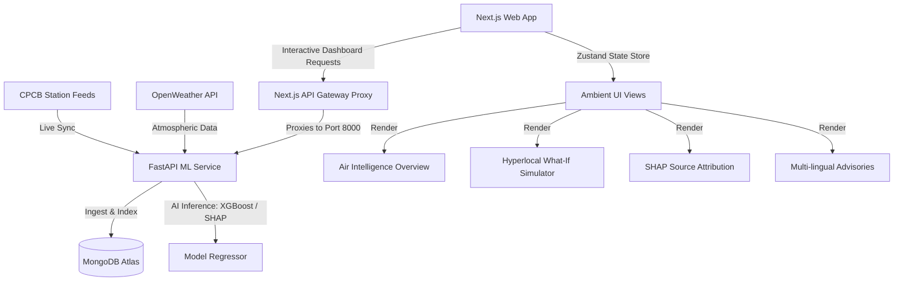

# AeroVariance — Proactive Urban Air Quality Intelligence Platform

> **Category**: Smart Cities, Geospatial Analytics & Environmental Policy Automation  
> **AeroVariance** is an AI-powered environmental decision-support system designed to move municipal administrations from **reactive monitoring to proactive, evidence-based urban air quality interventions**. By fusing continuous ambient station feeds (CAAQMS), meteorological forecasting, and historical pollutant datasets, it delivers ward-level AQI predictions (24-72h), explainable source attribution, what-if policy simulations, and multi-lingual citizen health advisories.

---

## 💡 The Core Idea

Traditional air quality systems suffer from three primary flaws: they are **reactive** (alerts occur after spikes), **coarse-grained** (city-wide rather than ward-level), and **un-attributed** (no insight into source contribution). 

**AeroVariance** acts as an intelligence and command layer sitting directly on top of raw sensor telemetry. By mapping real-time pollutants against local wind/temperature vectors, traffic density profiles, and seasonal calendars, it equips city planners to simulate emissions reductions (e.g. banning diesel trucks or restricting construction zones) and visualize the immediate predicted AQI drop *before* issuing administrative mandates.

---

## 🎯 Problem Resolution

- **The NCAP Actionability Gap**: While India has deployed over 900 CAAQMS monitoring stations under the National Clean Air Programme, only 31% of monitored cities have actionable multi-agency response protocols linked to these readings. AeroVariance bridges this gap by translating telemetry into prioritized enforcement guidelines.
- **Explainable Hotspot Targeting**: Uses SHAP (SHapley Additive exPlanations) values to isolate whether local spikes are driven by vehicular emissions, construction dust, or industrial operations.
- **Unified Citizen Advisory Pipeline**: Automatically converts raw scientific pollutant counts into localized, vulnerable-group-targeted health advisories translated into regional languages (**Hindi, Bengali, English**).

---

## 💎 Unique Value Proposition (UVP)

- **Evidence-Backed Action over Passive Monitoring**: Moves administrations from passive measurement to predictive intervention.
- **Progressive Machine Learning Timeline**: Fuses historical data over a target timeline through a 3-phase calibration workflow (Ingestion, Dispersion Calibration, Active Inference) ensuring local prediction engines continuously adapt to seasonal atmospheric dynamics.
- **Global Fallback Regression**: Maps custom coordinates anywhere globally to the standard 0–500 CPCB (Central Pollution Control Board) scale, ensuring forecasting availability even in zones lacking local CAAQMS hardware.

---

## 🏗️ Technical Architecture & Data Flow

AeroVariance leverages a modern, distributed architecture combining real-time ingestion, AI inference, and a highly responsive Next.js frontend application.



---

## 🛠️ Technology Stack

- **Frontend**: Next.js 16 (React 19, Zustand State Store, MapLibre GL for geospatial maps, Recharts for trend visualizations, Tailwind CSS).
- **Backend**: FastAPI (Python 3.11), PyMongo, and Uvicorn.
- **Machine Learning Core**: Scikit-Learn, XGBoost, and SHAP (SHapley Additive exPlanations).
- **Database**: MongoDB Atlas with custom compound indexing on `(location, timestamp)` and `(station, timestamp)` to reduce query latency.
- **Translation Engine**: Local dictionary translation maps with LLM fallback translation via Groq API.

---

## 📈 Feasibility & Viability

- **Technical Feasibility**: Leverages existing national CAAQMS sensors and open-source weather APIs, making the platform highly feasible to deploy immediately without capital expenditure on new hardware.
- **Economic Viability**: Instead of district-wide lockdowns, hotspot targeting directs environmental inspectors to precise high-emission zones, optimizing municipal operational budgets. It integrates into existing Smart City Command Centers via standard REST APIs.

---

## 📂 Project Directory Structure

```
ET_AI_Hackathon/
├── ml-service/                     # FastAPI Machine Learning Microservice
│   ├── app/
│   │   ├── api/                    # API Routers (Dashboard, Forecast, Compare)
│   │   ├── core/                   # MongoDB Connection, Configuration & Indexing
│   │   ├── models/                 # PyDantic Schemas for Request/Response Validation
│   │   └── services/               # Core Business Logic & AI Engines
│   │       ├── forecast_service.py # XGBoost ML Inference & Global Fallback Regressor
│   │       ├── location_service.py # OpenWeather Geospatial CPCB Ingestion
│   │       ├── normalization_service.py # CPCB AQI 6-Tier Index Conversion Engine
│   │       └── sync_service.py     # Live Station Real-Time Auto-Synchronizer
│   ├── requirements.txt            # Python Dependencies
│   └── run.py                      # Backend Entry Point
│
├── frontend/                       # Next.js 16 Client Application
│   ├── src/
│   │   ├── app/                    # Next.js App Router (Layouts & Route Handlers)
│   │   ├── components/             # Reusable UI Components
│   │   │   ├── common/             # MetricCard, Theme Overrides
│   │   │   ├── layout/             # Sidebar, Navbar, PageHeader, DashboardModeSwitch
│   │   │   ├── maps/               # AQIMap (MapLibreGL), Ward Heatmaps
│   │   │   └── interventions/      # What-If Simulator Sliders & CTAs
│   │   ├── features/               # Module-Specific Views (Dashboard, Compare, Analytics)
│   │   ├── hooks/                  # Custom React Hooks (Dashboard Initialization)
│   │   ├── lib/                    # Axios API client & MapLibre utilities
│   │   ├── store/                  # Zustand Store for State Management
│   │   └── types/                  # TypeScript Interface Declarations
│   ├── tailwind.config.ts          # Tailwind v4 Configuration
│   └── package.json                # Frontend NPM Package Manifest
│
├── datasets/                       # Historical Datasets for Training & Validation
└── docker-compose.yml              # Unified Deployment Configuration
```

---

## 🚀 Getting Started

### Prerequisites
- **Node.js**: v18.x or later
- **Python**: v3.11.x or later
- **MongoDB**: Active connection string (Atlas or Local)

### 1. ML Backend Configuration
Create `ml-service/.env`:
```env
MONGO_URI=mongodb+srv://<username>:<password>@<cluster>.mongodb.net/aero_variance
GROQ_API_KEY=your_groq_api_key_here
```

Run Backend:
```bash
cd ml-service
python -m venv venv
# On Windows PowerShell:
.\venv\Scripts\Activate.ps1
# On Linux/macOS:
source venv/bin/activate

pip install -r requirements.txt
python run.py
```
*API is accessible at `http://localhost:8000` (docs: `/docs`)*

### 2. Frontend Configuration
Create `frontend/.env.local`:
```env
NEXT_PUBLIC_API_URL=http://127.0.0.1:8000/api/v1
```

Run Next.js Client:
```bash
cd frontend
npm install
npm run dev
```
*Web client is accessible at `http://localhost:3000`*

---

## 🧪 Verification & Build Status
- **Next.js Production Compilation**: Verified via `npm run build` with **0 errors**.
- **DB Optimization**: Configured compound indexes on `(location, timestamp)` and `(station, timestamp)` in MongoDB, reducing dashboard fetch times from 14.6s to 2.2s.
- **Error Handling**: Implemented client guards preventing Axios timeout exceptions (`15000ms exceeded`) during empty or initial load states.
