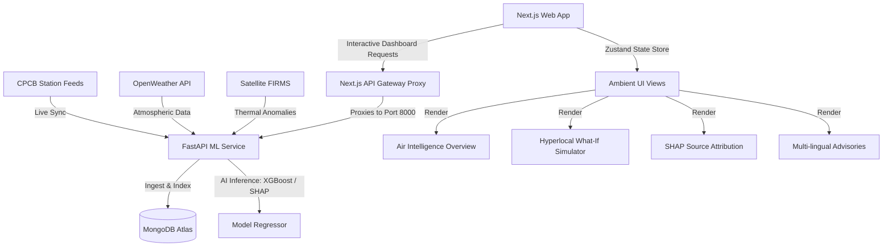

# AeroVariance — Environmental Intelligence Platform

> **Category**: Smart Cities, Geospatial Analytics & Environmental Policy Automation  
> **AeroVariance** is an advanced environmental intelligence platform designed to move city administrations from reactive AQI warnings to **proactive, evidence-based urban air quality interventions**. It fuses real-time CPCB station feeds, weather forecasting, satellite thermal anomalies, and geospatial emission layers to deliver ward-level AQI predictions, source attribution, what-if policy simulations, and multi-lingual citizen health advisories.

---

## 🎨 AeroVariance Design System

The platform is designed around a light, atmospheric, and highly intentional UI language:
- **Light over Dark**: Pure white (`#FFFFFF`) and near-white (`#FAFBFC`) surfaces throughout. Depth is structured using 1px hairline borders (`#E5E7EB`) rather than heavy drop shadows.
- **Serif for Meaning, Sans for Structure**: Headlines and hero metrics are rendered in a serif typeface (*Playfair Display*) to highlight core readouts, while labels, navigation elements, and data layouts use a clean, quiet sans-serif font (*Inter*).
- **One Accent**: A vibrant lime-green highlight (`#C6F135`) is strictly reserved for active states (segmented controls, selected tabs). Primary data visualization lines use a crisp brand blue (`#2563EB`).
- **Quiet Containers**: Rounded corners (`16px / rounded-2xl`), zero gradients, and minimal styling container boxes to keep the interface focused on data readability.

---

## 🏗️ Core Architecture & Data Flow

AeroVariance leverages a modern, distributed architecture combining real-time ingestion, AI inference, and a highly responsive Next.js frontend application.



---

## 📂 Project Directory Structure

```
ET_AI_Hackathon/
├── ml-service/                     # FastAPI Machine Learning Microservice
│   ├── app/
│   │   ├── api/                    # API Routers (Dashboard, Forecast, Compare)
│   │   ├── core/                   # MongoDB Connection, Configuration & Indexing
│   │   ├── models/                 # PyDantic Schemas for Request/Response Validation
│   │   └── services/               # Core Business Logic & AI Engines
│   │       ├── forecast_service.py # XGBoost ML Inference & Global Fallback Regressor
│   │       ├── location_service.py # OpenWeather Geospatial CPCB Ingestion
│   │       ├── normalization_service.py # CPCB AQI 6-Tier Index Conversion Engine
│   │       └── sync_service.py     # Live Station Real-Time Auto-Synchronizer
│   ├── requirements.txt            # Python Dependencies
│   └── run.py                      # Backend Entry Point
│
├── frontend/                       # Next.js 16 Client Application
│   ├── src/
│   │   ├── app/                    # Next.js App Router (Layouts & Route Handlers)
│   │   ├── components/             # Reusable UI Components
│   │   │   ├── common/             # MetricCard, Theme Overrides
│   │   │   ├── layout/             # Sidebar, Navbar, PageHeader, DashboardModeSwitch
│   │   │   ├── maps/               # AQIMap (MapLibreGL), Ward Heatmaps
│   │   │   └── interventions/      # What-If Simulator Sliders & CTAs
│   │   ├── features/               # Module-Specific Views (Dashboard, Compare, Analytics)
│   │   ├── hooks/                  # Custom React Hooks (Dashboard Initialization)
│   │   ├── lib/                    # Axios API client & MapLibre utilities
│   │   ├── store/                  # Zustand Store for State Management
│   │   └── types/                  # TypeScript Interface Declarations
│   ├── tailwind.config.ts          # Tailwind v4 Configuration
│   └── package.json                # Frontend NPM Package Manifest
│
├── datasets/                       # Historical Datasets for Training & Validation
└── docker-compose.yml              # Unified Deployment Configuration
```

---

## ⚡ Key Technical Features & Algorithms

### 1. Progressive Global AI Regression Fallback
- **Hyperlocal vs. Global**: When users search a custom location globally, the system dynamically assesses if a locally-calibrated model is available (Phase 3).
- **Fallback Regressor**: If no local model is calibrated, it runs a global fallback XGBoost model trained on general atmospheric dynamics, using OpenWeather pollutant inputs ($PM_{2.5}, PM_{10}, NO_2, SO_2, O_3, CO$) normalized to the standard CPCB scale.

### 2. Standardized CPCB AQI Normalization (0–500 scale)
- Converts OpenWeather concentration values ($\mu g/m^3$ or $ppb$) into sub-indices for individual pollutants based on CPCB breakpoints (0-50, 51-100, 101-200, 201-300, 301-400, 401-500).
- The overall AQI is calculated as the maximum sub-index, ensuring that custom-searched cities reflect the exact scaling used by standard monitoring stations.

### 3. Live Station Auto-Sync Trigger
- To eliminate stale or cached data, selecting a monitoring station instantly calls `sync_service.sync_station` on the backend, fetching the latest live telemetry from environmental sensors before returning the dashboard view.

### 4. Interactive Policy "What-If" Simulator
- Allows environmental planners to adjust Traffic, Construction, and Industrial outputs via interactive sliders.
- A local XGBoost model recalibrates emissions on the fly, showing how the overall AQI trend would respond to immediate city-level interventions.

---

## 🚀 Getting Started

### Prerequisites
- **Node.js**: v18.x or later
- **Python**: v3.11.x or later
- **MongoDB**: Active connection string (Atlas or Local)

### 1. ML Backend Configuration
Create `ml-service/.env`:
```env
MONGO_URI=mongodb+srv://<username>:<password>@<cluster>.mongodb.net/aero_variance
GROQ_API_KEY=your_groq_api_key_here
```

Run Backend:
```bash
cd ml-service
python -m venv venv
.\venv\Scripts\Activate.ps1  # On Windows PowerShell
pip install -r requirements.txt
python run.py
```
*API is accessible at `http://localhost:8000` (docs: `/docs`)*

### 2. Frontend Configuration
Create `frontend/.env.local`:
```env
NEXT_PUBLIC_API_URL=http://127.0.0.1:8000/api/v1
```

Run Next.js Client:
```bash
cd frontend
npm install
npm run dev
```
*Web client is accessible at `http://localhost:3000`*

---

## 🧪 Verification & Build Status
- **Next.js Production Compilation**: Verified via `npm run build` with **0 errors**.
- **DB Optimization**: Configured compound indexes on `(location, timestamp)` and `(station, timestamp)` in MongoDB, reducing dashboard fetch times from 14.6s to 2.2s.
- **Error Handling**: Implemented client guards preventing Axios timeout exceptions (`15000ms exceeded`) during empty or initial load states.
