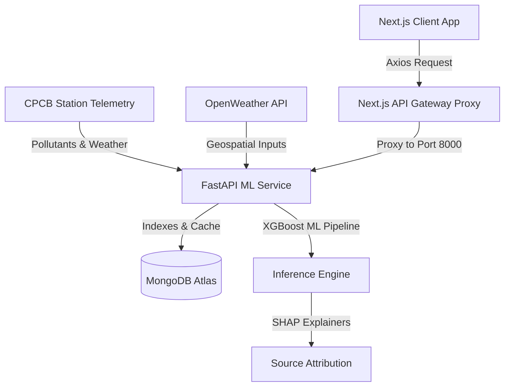

# AeroVariance — Official Hackathon Submission Documentation

> **Theme**: Smart Cities / Environmental Intelligence / Geospatial Analytics / Public Health  
> **Project Title**: AeroVariance: Proactive Urban Air Quality Intelligence Platform  

---

## 💡 1. The Core Idea

**AeroVariance** is an AI-powered urban air quality intelligence platform designed to move municipal administrations from **reactive monitoring to proactive, evidence-based environmental policy intervention**. 

Instead of simply measuring pollution, AeroVariance functions as a decision-support system. It combines real-time sensor telemetry from Continuous Ambient Air Quality Monitoring Stations (CAAQMS), meteorological forecasting, and historical pollutant datasets to provide ward-level AQI predictions (24-72 hours), explainable source attribution, what-if policy simulations, and multi-lingual health advisories.

---

## 🎯 2. Problem Resolution

### The Current Gaps
1. **The Inaction Gap**: While India has deployed over 900 CAAQMS monitoring stations, a recent CAG audit revealed that **only 31% of monitored cities** have actionable multi-agency response protocols linked to these readings. Data is collected, but not acted upon.
2. **Lack of Attribution**: Administrations know when the AQI is high, but they lack localized source attribution. They cannot isolate whether a local spike is driven by vehicular density, construction dust, industrial stacks, or seasonal crop burning.
3. **No Simulation Capabilities**: City planners must guess the impact of interventions (such as vehicle bans or construction halts) rather than modeling the environmental benefits beforehand.

### How AeroVariance Resolves Them
- **Enforcement Action Mapping**: Converts raw telemetry into localized source attribution charts (powered by SHAP feature explainers) to pinpoint the exact driver of a pollution spike.
- **Hyperlocal Policy Simulator**: Planners can adjust sliders (Traffic, Construction, Industry) to simulate emissions reductions and visualize the predicted drop in AQI *before* issuing administrative mandates.
- **Citizen Engagement Loop**: Automatically translates complex AQI telemetry into localized, vulnerable-group-targeted health advisories in regional languages (**Hindi, Bengali, English**), helping individuals make safer daily choices.

---

## 💎 3. Unique Value Proposition (UVP)

- **Evidence-Backed Action over Passive Monitoring**: AeroVariance bridges the gap between raw data collection and operational policy. It generates a clear path of action (e.g., specific sector limits) based on current air dispersion models.
- **Progressive Machine Learning Timelines**: Implements a 3-phase calibration workflow (Ingestion, Calibration, Active Inference) that ensures model predictions continuously adapt to localized seasonal wind, temperature, and traffic variations over a 60-day window.
- **Global Fallback Regression**: By mapping custom geolocation coordinate searches to standard CPCB index scales, any user worldwide can receive real-time, normalized predictive forecasts even in areas without dedicated CPCB hardware.

---

## 🛠️ 4. Technology Stack

- **Frontend**: Next.js 16 (React 19, Zustand State Store, MapLibre GL for geospatial maps, Recharts for trend visualizations, Tailwind CSS for the AeroVariance Design System).
- **Backend**: FastAPI (Python 3.11), PyMongo for database communication, and Uvicorn server hosting.
- **Machine Learning Core**: Scikit-Learn, XGBoost, and SHAP (SHapley Additive exPlanations) for source attribution mapping.
- **Database**: MongoDB Atlas with custom compound indexing on `(location, timestamp)` and `(station, timestamp)` to minimize search latency.
- **Translation Engine**: Local dictionary translation maps with LLM fallback translation via Groq API.

---

## 📈 5. Feasibility & Viability

### Technical Feasibility
- **Data Integration**: Leverages existing national CAAQMS stations and open-source weather APIs (OpenWeather), making the platform highly feasible to deploy immediately without new sensor infrastructure.
- **Modern ML Tooling**: By running lightweight, pre-trained XGBoost regressors on the backend and offloading map rendering to client-side WebGL (MapLibre), the platform maintains low compute requirements, running efficiently on modest cloud servers.

### Economic Viability
- **Low Capital Expenditure**: Since it interfaces with existing sensors and open APIs, municipal deployment requires no capital expenditure on hardware.
- **Reduced Enforcement Cost**: Instead of blanket policing across entire districts, the platform's hotspot targeting directs environmental inspectors to precise high-emission zones, optimizing municipal operational budgets.
- **Adoption Framework**: Easily integrates into existing Smart City Command Centers via standard REST APIs, facilitating quick adoption by state pollution control boards (e.g., WBPCB).

---

## 🏗️ 6. Technical Architecture



---

## 📁 7. API Reference & Data Models

### Data Models (Pydantic Schemas)

#### `Station`
```python
class Station(BaseModel):
    station: str          # Name of the monitoring station
    city: str             # City name
    latitude: float       # Latitude coordinate
    longitude: float      # Longitude coordinate
    active: bool          # Ingestion status
```

#### `StationLatestReading`
```python
class StationLatestReading(BaseModel):
    aqi: float            # Normalized CPCB AQI
    pm25: float           # PM2.5 concentration (ug/m3)
    pm10: float           # PM10 concentration (ug/m3)
    co: float             # CO concentration (ppb)
    no2: float            # NO2 concentration (ug/m3)
    so2: float            # SO2 concentration (ug/m3)
    o3: float             # O3 concentration (ug/m3)
    category: str         # CPCB category (e.g. Good, Satisfactory, Poor)
    timestamp: str        # ISO-formatted ISO8601 string
```

#### `ForecastResponse`
```python
class ForecastResponse(BaseModel):
    predicted_aqi: float  # AI Predicted AQI
    confidence: float     # Model confidence score (0.0 to 1.0)
    category: str         # CPCB category designation
    timestamp: str        # Target timestamp
```

#### `TranslateRequest` & `TranslateResponse`
```python
class TranslateRequest(BaseModel):
    text: str             # Input text to translate
    target_lang: str      # Target language code ('en', 'hi', 'bn')

class TranslateResponse(BaseModel):
    translated_text: str  # Translated output text
```

---

### Endpoint Specifications

#### 1. List Stations
- **URL**: `GET /api/v1/stations`
- **Response**: `List[Station]`

#### 2. Get Station Dashboard
- **URL**: `GET /api/v1/dashboard`
- **Parameters**: `station` (string, optional)
- **Response**:
  ```json
  {
    "latest_reading": {
      "aqi": 182,
      "pm25": 82,
      "pm10": 140,
      "co": 320,
      "no2": 45,
      "so2": 12,
      "o3": 28,
      "category": "Moderate",
      "timestamp": "2026-07-21T22:30:00Z"
    },
    "forecast": {
      "predicted_aqi": 168.4,
      "confidence": 0.88,
      "category": "Moderate",
      "timestamp": "2026-07-22T22:30:00Z"
    },
    "advisory": {
      "risk": "Medium",
      "message": "Sensitive groups should wear masks and avoid prolonged outdoor activity.",
      "outdoor": "Limit strenuous activity",
      "mask": true,
      "color": "#FEF3C7"
    }
  }
  ```

#### 3. Trigger Real-Time Station Sync
- **URL**: `POST /api/v1/sync`
- **Parameters**: `station` (string)
- **Response**:
  ```json
  {
    "status": "success",
    "synchronized_at": "2026-07-22T02:40:00Z"
  }
  ```

#### 4. Translate Advisory
- **URL**: `POST /api/v1/advisories/translate`
- **Request Body**: `TranslateRequest`
- **Response**: `TranslateResponse`
