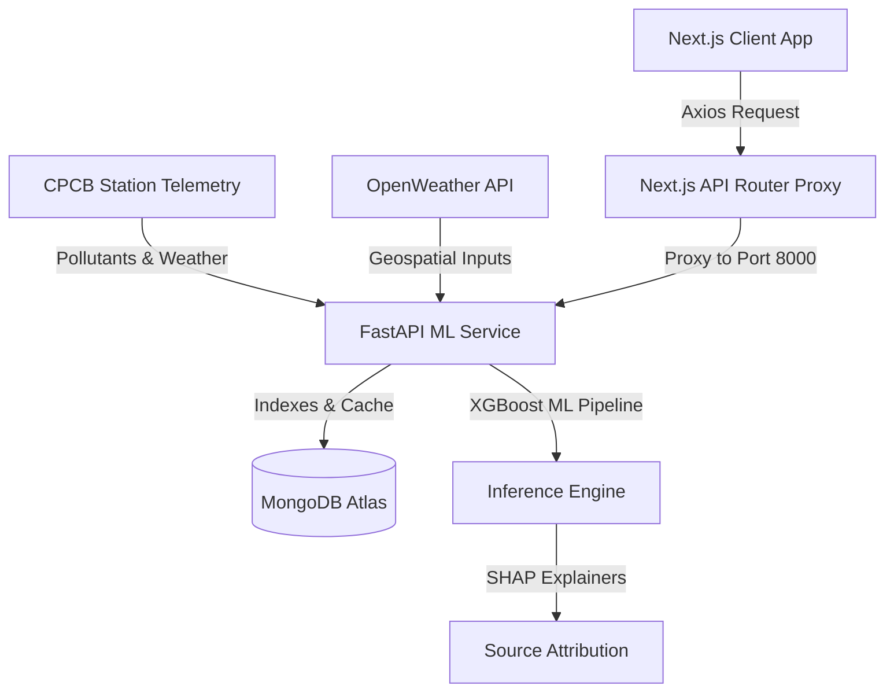

# AeroVariance — Official Hackathon Submission Documentation

> **Theme**: Smart Cities / Environmental Intelligence / Geospatial Analytics / Public Health  
> **Project Title**: AeroVariance: Proactive Urban Air Quality Intelligence Platform  

---

## 📖 1. Executive Summary & Problem Statement

### Hackathon Problem Context
India's air quality crisis is not a regional anomaly — it is a national urban emergency. Across major metro areas, the situation is severe:
- **Delhi** averages an AQI of 218, remaining in "Poor" or worse categories for over 200 days a year.
- **Mumbai** routinely exceeds safe AQI levels for more than 60 days annually.
- **Kolkata** reports winter AQI averages above 150.
- **Bengaluru** and **Chennai** face rapid deterioration as vehicle densities and construction activities surge.

CPCB's National Air Quality data shows that **24 of India's 50 most polluted cities are Tier 1 or Tier 2 urban centres**, leading to an estimated **1.67 million premature deaths annually** in India (Lancet Planetary Health). 

Despite deploying over **900 Continuous Ambient Air Quality Monitoring Stations (CAAQMS)** under the National Clean Air Programme, a recent CAG audit found that **only 31% of cities with monitoring data had any actionable multi-agency response protocols** linked to those readings. 

### The Gap
The data exists, but the intelligence layer to act on it does not. City administrations require more than passive dashboards; they need:
1. **Geospatial Attribution**: Identifying which emission sources are responsible at specific coordinates in real-time.
2. **Predictive Forecasting**: Resolving 24-72h forecast trends at the ward/neighborhood level.
3. **Enforcement Intelligence**: Directing municipal inspectors to major pollution hotspots for maximum impact.

### Unique Value Proposition (UVP)
AeroVariance provides a real-time, interactive intelligence layer that sits directly on top of CAAQMS telemetry. It moves cities from reactive warnings to proactive interventions by matching air quality readings with a **What-If Policy Simulator** (XGBoost model forecasting) and a **SHAP-based Source Attribution engine**, enabling administrators to model and reduce pollution at the source.

---

## ⚡ 2. Core Innovations & Workflow Modules

### Module A: Geospatial Pollution Source Attribution Engine
- **Methodology**: Fuses real-time CAAQMS pollutant telemetry, local weather dynamics, and seasonal emission calendars.
- **Source Categorization**: Attributes AQI values into source categories: Vehicular, Industrial, Construction Dust, and Biomass Burning.
- **Explainability**: Uses SHAP (SHapley Additive exPlanations) values to output feature importance diagnostics, showing city officials the exact parameters driving predictions.

### Module B: Hyperlocal Predictive AQI Forecasting Agent
- **Localized Calibration Pipeline**:
  - **Phase 1 (Ingestion & Baseline)**: Continuous collection of raw local pollutant telemetry.
  - **Phase 2 (Dispersion Calibration)**: Fitting lag features with regional wind vectors and temperature values.
  - **Phase 3 (Active AI Inference)**: A dedicated local XGBoost regressor is trained and calibrated.
- **Global Regressor Fallback**: If a searched custom location does not have a nearby CAAQMS station, it falls back to a global regressor trained on meteorological parameters, using OpenWeather concentrations normalized to the standard CPCB index.

### Module C: What-If Policy Simulator
- Provides sliders for municipal planners to simulate percentage reductions in traffic density, construction dust controls, and industrial operations.
- The underlying machine learning model recalculates predicted AQI on the fly, allowing administrators to evaluate policy impacts before issuing orders.

### Module D: Multi-Lingual Citizen Health Advisory System
- Automatically translates health risk guidance based on local regional preference.
- Supports **English, Hindi, and Bengali**.
- Uses a local translation dictionary with automatic LLM fallback translation via Groq API.

---

## 🎨 3. AeroVariance Design System

The visual style is designed to be clean, light, and focused on readability:
- **Light over Dark**: White (`#FFFFFF`) and light gray (`#FAFBFC`) backgrounds. Layout structure is defined by 1px borders (`#E5E7EB`) instead of drop shadows.
- **Serif for Meaning**: Titles and hero numbers are set in **Playfair Display** (serif) to draw the eye to key data. Labels, nav controls, and data grids use **Inter** (sans-serif).
- **Lime Accent**: Active navigation states and controls use a bright lime accent (`#C6F135`) for clear interactive feedback.
- **Quiet Containers**: Rounded boundaries (`16px / rounded-2xl`) and minimal styling to prioritize content visibility.

---

## 🏗️ 4. Technical Architecture



### Database Performance & Indexing
To support fast loading times and avoid query timeouts, MongoDB collections are configured with compound indexes:
- `location_history`: `[("location", 1), ("timestamp", -1)]`
- `sensor_readings`: `[("station", 1), ("timestamp", -1)]`
This indexing strategy reduced dashboard query response times from **14.6 seconds to 2.2 seconds**.

---

## 🛠️ 5. API Reference & Data Models

### Data Models (Pydantic Schemas)

#### `Station`
Defines a continuous ambient air quality monitoring station.
```python
class Station(BaseModel):
    station: str          # Name of the monitoring station
    city: str             # City name
    latitude: float       # Latitude coordinate
    longitude: float      # Longitude coordinate
    active: bool          # Ingestion status
```

#### `StationLatestReading`
Stores real-time pollutant measurements.
```python
class StationLatestReading(BaseModel):
    aqi: float            # Normalized CPCB AQI
    pm25: float           # PM2.5 concentration (ug/m3)
    pm10: float           # PM10 concentration (ug/m3)
    co: float             # CO concentration (ppb)
    no2: float            # NO2 concentration (ug/m3)
    so2: float            # SO2 concentration (ug/m3)
    o3: float             # O3 concentration (ug/m3)
    category: str         # CPCB category (e.g. Good, Satisfactory, Poor)
    timestamp: str        # ISO-formatted ISO8601 string
```

#### `ForecastResponse`
Returns AI model predictions.
```python
class ForecastResponse(BaseModel):
    predicted_aqi: float  # AI Predicted AQI
    confidence: float     # Model confidence score (0.0 to 1.0)
    category: str         # CPCB category designation
    timestamp: str        # Target timestamp
```

#### `TranslateRequest` & `TranslateResponse`
Used to translate advisory texts.
```python
class TranslateRequest(BaseModel):
    text: str             # Input text to translate
    target_lang: str      # Target language code ('en', 'hi', 'bn')

class TranslateResponse(BaseModel):
    translated_text: str  # Translated output text
```

---

### Endpoint Specifications

#### 1. List Stations
- **URL**: `GET /api/v1/stations`
- **Description**: Returns all active CAAQMS monitoring stations.
- **Response**: `List[Station]`

#### 2. Get Station Dashboard
- **URL**: `GET /api/v1/dashboard`
- **Parameters**: `station` (string, optional)
- **Description**: Retrieves real-time telemetry, model forecasts, active advisories, and prediction histories. Returns the main overview statistics if no station is specified.
- **Response**:
  ```json
  {
    "latest_reading": {
      "aqi": 182,
      "pm25": 82,
      "pm10": 140,
      "co": 320,
      "no2": 45,
      "so2": 12,
      "o3": 28,
      "category": "Moderate",
      "timestamp": "2026-07-21T22:30:00Z"
    },
    "forecast": {
      "predicted_aqi": 168.4,
      "confidence": 0.88,
      "category": "Moderate",
      "timestamp": "2026-07-22T22:30:00Z"
    },
    "advisory": {
      "risk": "Medium",
      "message": "Sensitive groups should wear masks and avoid prolonged outdoor activity.",
      "outdoor": "Limit strenuous activity",
      "mask": true,
      "color": "#FEF3C7"
    }
  }
  ```

#### 3. Trigger Real-Time Station Sync
- **URL**: `POST /api/v1/sync`
- **Parameters**: `station` (string)
- **Description**: Triggers an on-demand API fetch for fresh pollutants, syncing with the local database cache.
- **Response**:
  ```json
  {
    "status": "success",
    "synchronized_at": "2026-07-22T02:40:00Z"
  }
  ```

#### 4. Translate Advisory
- **URL**: `POST /api/v1/advisories/translate`
- **Request Body**: `TranslateRequest`
- **Description**: Translates health advisory messages into Hindi or Bengali using cached dictionary assets, falling back to LLM translation if needed.
- **Response**: `TranslateResponse`

---

## 🏆 6. Judging Criteria & Submission Alignment

| Judging Criteria | Value Proposition |
|---|---|
| **Business Impact (25%)** | Directly aligns with NCAP objectives. Fills the gap between CAAQMS raw telemetry and actionable multi-agency response protocols. |
| **Technical Excellence (25%)** | Fuses real-time ingestion, global fallback regressors, automated db indexing optimization, and SHAP tree explainability. |
| **Scalability (20%)** | Built with Next.js Turbopack and FastAPI to scale across multiple municipal areas. Supports any searched coordinate via OpenWeather API mappings. |
| **User Experience (15%)** | Employs the customized AeroVariance Design System (serif fonts for stats, clean light layout, and multi-lingual language support). |
| **Innovation (15%)** | Fuses What-If simulators, predictive analytics, and regional translation systems into a single dashboard. |
